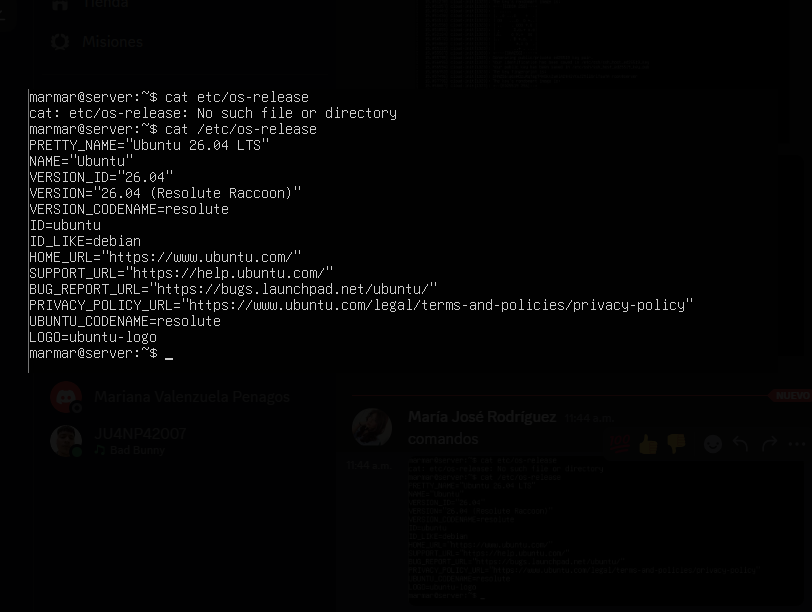
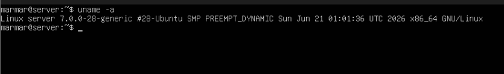
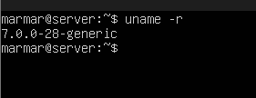

# Taller Práctico: Instalación de Ubuntu Server en Oracle VM VirtualBox


## Integrantes

- Nombre 1 // Mariana Valenzuela Penagos
- Nombre 2 // Maria Jose Rodriguez Oyola


Tener descargada la imagen de ubuntu, asignarle un nombre, la OS que sea Linux, la distribución Ubuntu y la version Plucky Puffin 64-bit,no se se le debe dar a instalación desatendida.


ahora se configuran los recursos en la vm a partir de los recursos de nuestra pc.


Una vez configurada nuestra vm se debe encender.


Seleccionamos el idioma.


Elegimos la distribución del teclado.


Instalamos Ubuntu completo.


Esto se deja tal cual a como está.


El proxy se deja vacío.


Se deja igual.


Seleccionamos el disco.


Aceptamos.


Nos saltamos la actualización.


Configuramos nuestras credenciales.


Nos saltamos ubuntu pro.


Activamos el SHH.


Aceptamos.


Terminamos la instalación y reiniciamos.


Le undimos la letra scape y no saldra esto.


Ponemos el login con el que configuramos el server.


y ya podemos empezar a escribir los comandos en nuestra consola.


-------------------
# Comandos

```
cat /etc/os-release  
```
sirve para identificar qué distribución y versión de Linux está ejecutando el sistema.



```
uname -a       
```
sirve para conocer los detalles del kernel y la arquitectura del sistema operativo.



```
uname -r        
```
sirve para identificar la versión del kernel instalada y en uso actualmente.




```

        
```