# Comandos básicos de Ubuntu en WSL

## Mostrar la información del sistema operativo

```bash
cat /etc/os-release
```

Muestra la distribución de Linux instalada, su versión y otros datos del sistema operativo.

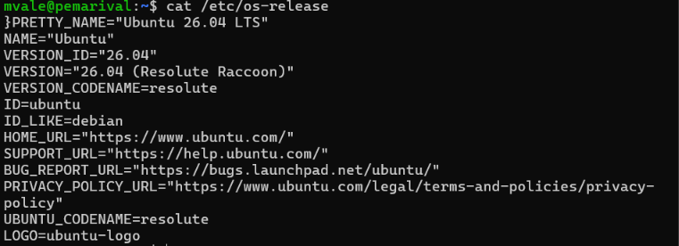
---

## Mostrar información del kernel

```bash
uname -a
```

Muestra información completa del kernel, arquitectura, nombre del equipo y sistema operativo.

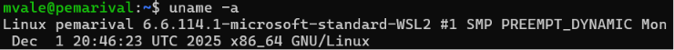

---

## Mostrar la versión del kernel

```bash
uname -r
```

Muestra únicamente la versión del kernel de Linux.

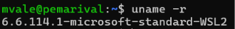

---

## Mostrar la arquitectura del procesador

```bash
uname -m
```

Indica la arquitectura del sistema, por ejemplo `x86_64`.

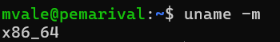

---

## Mostrar el nombre del equipo

```bash
hostname
```

Muestra el nombre del host o computadora.

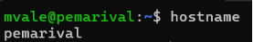

---

## Mostrar información del equipo

```bash
hostnamectl
```

Presenta información del sistema como hostname, sistema operativo, kernel y arquitectura.

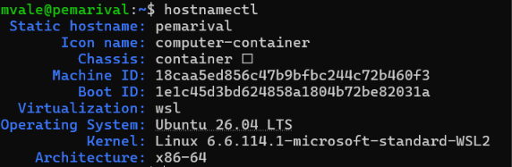

> Requiere que **systemd** esté habilitado en WSL.

---

## Mostrar el usuario actual

```bash
whoami
```

Indica el nombre del usuario que ha iniciado sesión.

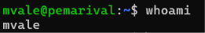

---

## Mostrar el identificador del usuario

```bash
id
```

Muestra el UID, GID y los grupos a los que pertenece el usuario.

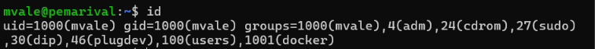

---

## Mostrar el directorio actual

```bash
pwd
```

Indica la ruta completa del directorio en el que se encuentra el usuario.

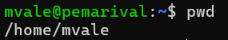

---

## Listar archivos

```bash
ls
```

Muestra los archivos y carpetas del directorio actual.


---

## Listar archivos detalladamente

```bash
ls -la
```

Muestra todos los archivos, incluidos los ocultos, junto con sus permisos, propietario y tamaño.

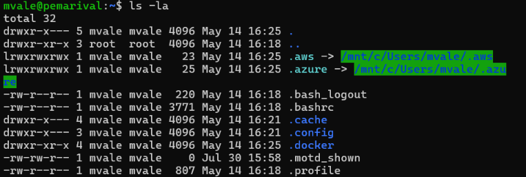

---

## Mostrar estructura de directorios

```bash
tree
```

Muestra la estructura de carpetas en forma de árbol.


> Requiere instalar el paquete `tree`.

---

## Mostrar la fecha y hora

```bash
date
```

Muestra la fecha y hora actual del sistema.


---

## Mostrar el tiempo de actividad

```bash
uptime
```

Indica cuánto tiempo lleva iniciada la sesión de WSL y la carga del sistema.

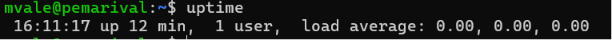

---

## Mostrar el uso de memoria

```bash
free -h
```

Muestra el uso de memoria RAM y swap en formato legible.

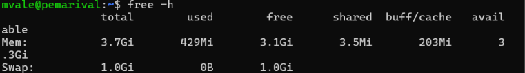

---

## Mostrar información del procesador

```bash
lscpu
```

Presenta información detallada de la CPU.

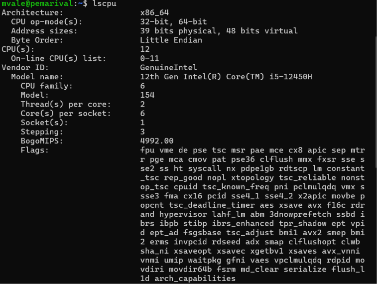
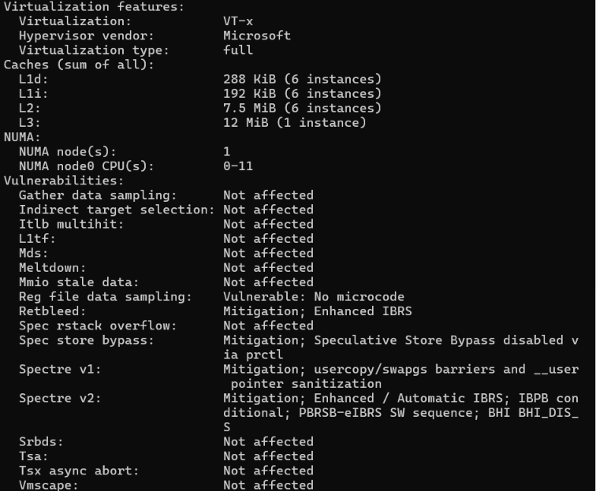

---

## Mostrar dispositivos de almacenamiento

```bash
lsblk
```

Lista los discos y particiones visibles desde WSL.

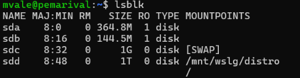

> Puede mostrar información limitada debido a la integración con Windows.

---

## Mostrar el espacio en disco

```bash
df -h
```

Muestra el espacio usado y disponible en los sistemas de archivos montados.

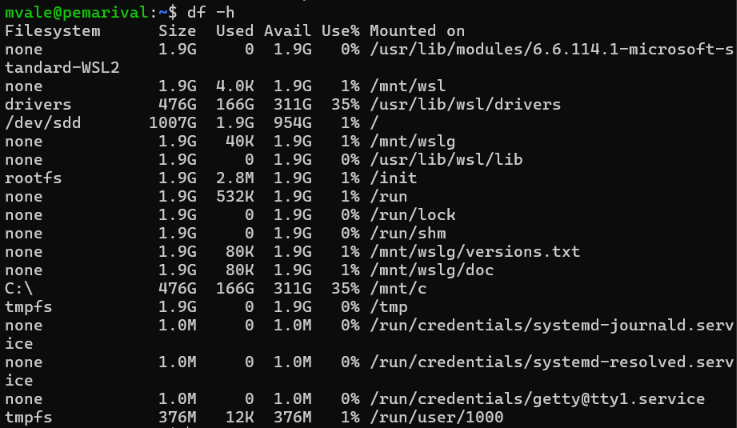

---

## Mostrar sistemas de archivos montados

```bash
mount
```

Lista todos los sistemas de archivos montados, incluidos los de Windows.

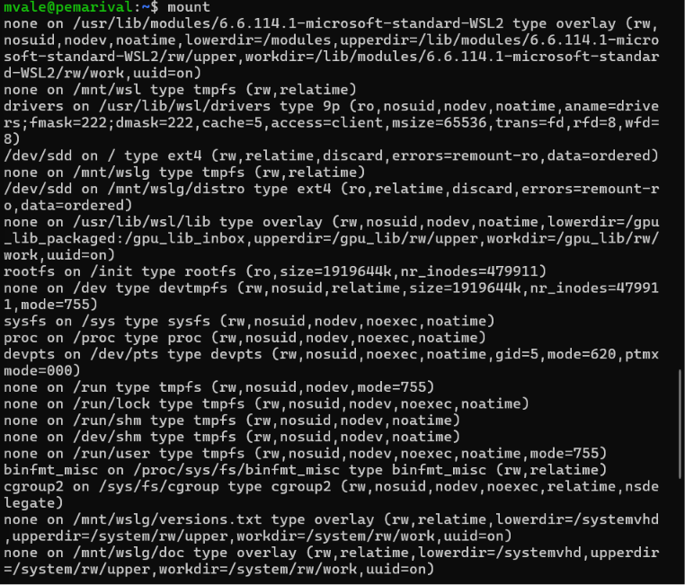
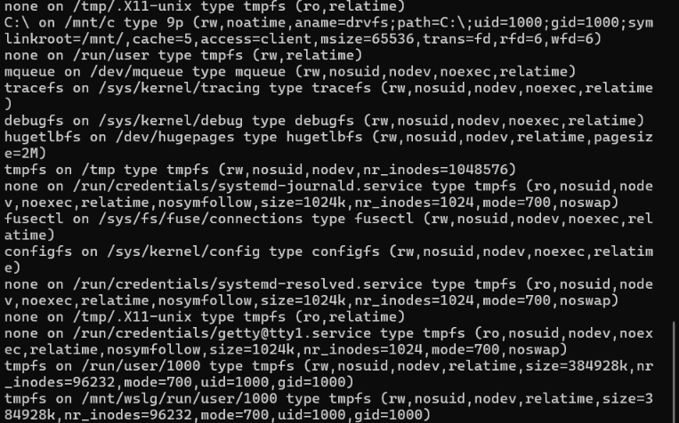
---

## Mostrar procesos en ejecución

```bash
ps aux
```

Muestra todos los procesos activos de la distribución Linux.

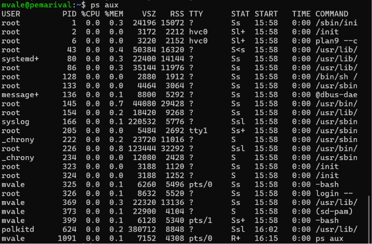

---

## Monitor de procesos

```bash
top
```

Muestra en tiempo real el consumo de CPU, memoria y procesos.

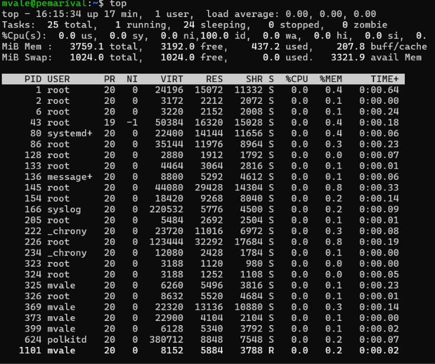

---

## Monitor de procesos mejorado

```bash
htop
```

Versión interactiva de `top` con una interfaz más amigable.

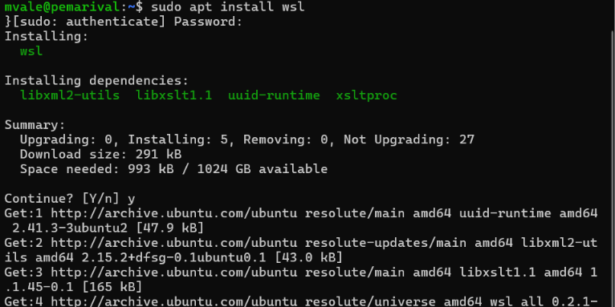

> Requiere instalar el paquete `htop`.

---

## Consultar el estado del servicio SSH

```bash
systemctl status ssh
```

Muestra si el servicio SSH está activo y su estado.


> Requiere que **systemd** esté habilitado.

---

## Listar los servicios

```bash
systemctl list-units --type=service
```

Lista los servicios administrados por `systemd`.

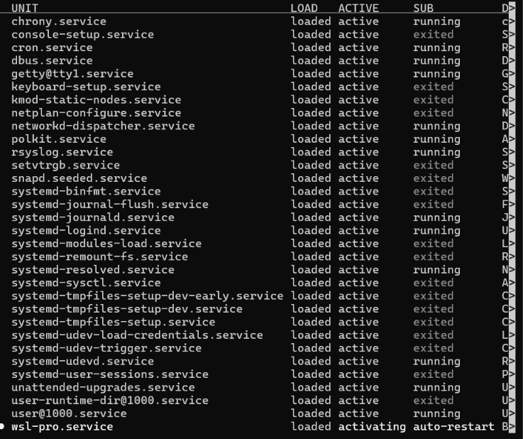

> Requiere que **systemd** esté habilitado.

---

## Mostrar direcciones IP

```bash
ip addr
```

Muestra las interfaces de red y sus direcciones IP.

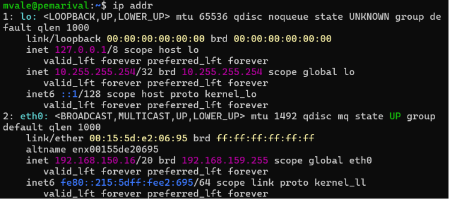
---

## Mostrar rutas de red

```bash
ip route
```

Muestra la tabla de enrutamiento del sistema.

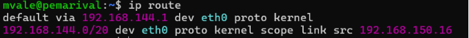
---

## Mostrar la IP del equipo

```bash
hostname -I
```

Muestra las direcciones IP asignadas a WSL.

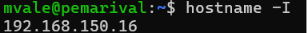
---

## Probar la conexión a Internet

```bash
ping 8.8.8.8
```

Comprueba la conectividad enviando paquetes al servidor DNS de Google.

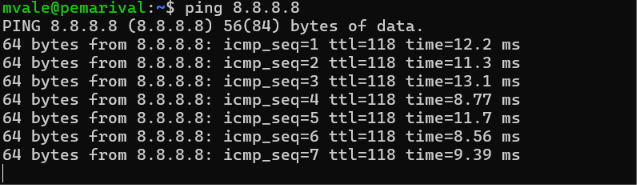

---

## Probar la resolución DNS

```bash
ping google.com
```

Comprueba tanto la conexión a Internet como la resolución de nombres DNS.

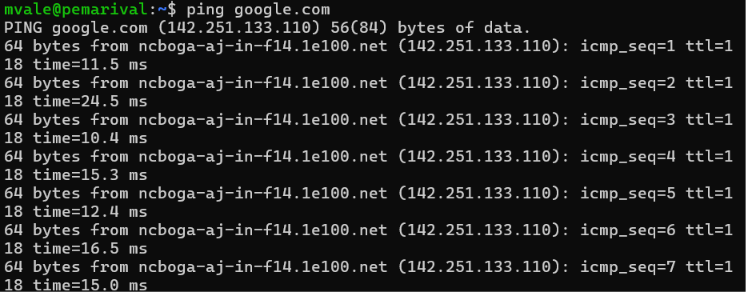
---

## Mostrar puertos abiertos

```bash
ss -tulnp
```

Lista los puertos TCP y UDP abiertos junto con los procesos asociados.

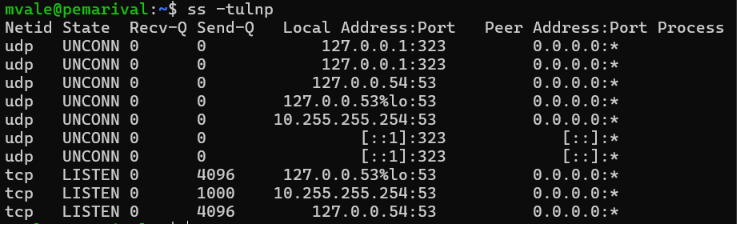

---

## Mostrar conexiones de red

```bash
netstat -tulnp
```

Muestra los puertos abiertos y conexiones activas.

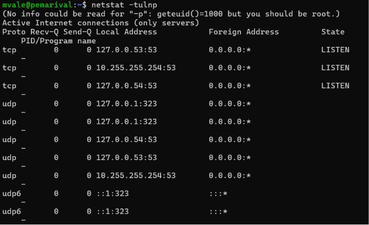

> Requiere instalar el paquete `net-tools`.

---

## Mostrar la IP pública

```bash
curl ifconfig.me
```

Obtiene la dirección IP pública del equipo desde Internet.

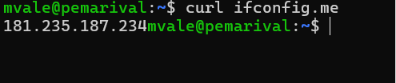

---

## Mostrar variables de entorno

```bash
env
```

Muestra todas las variables de entorno disponibles.

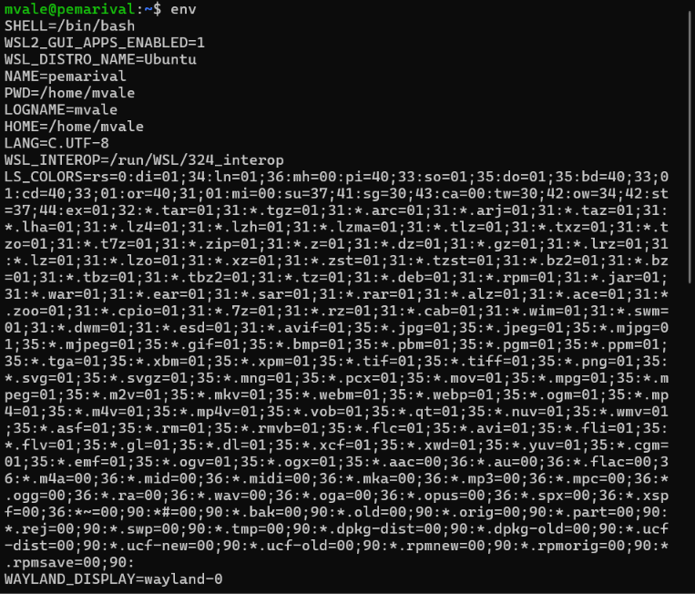

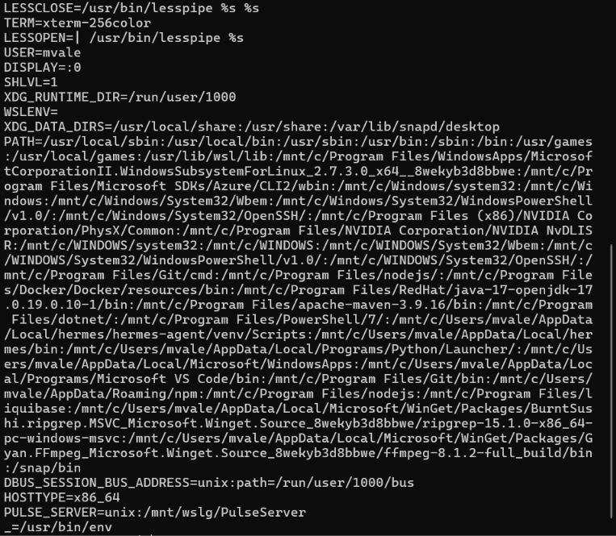
---

## Mostrar historial de comandos

```bash
history
```

Muestra el historial de comandos ejecutados por el usuario.

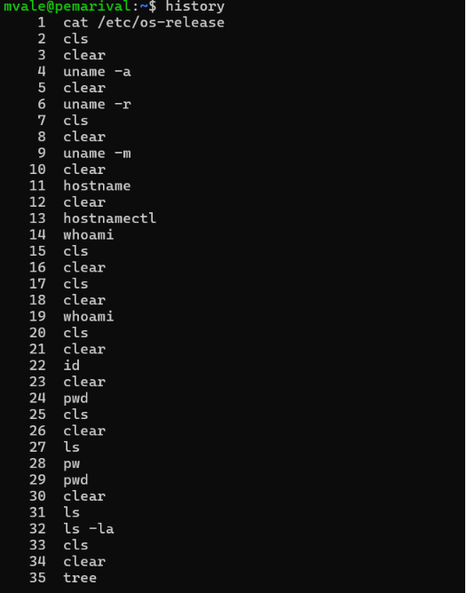

---

## Crear un directorio

```bash
mkdir practica
```

Crea una carpeta llamada `practica`.

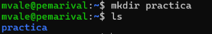

---

## Cambiar de directorio

```bash
cd practica
```

Ingresa al directorio llamado `practica`.


---

## Crear un archivo vacío

```bash
touch archivo.txt
```

Crea un archivo vacío llamado `archivo.txt`.

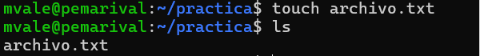

---

## Editar un archivo

```bash
nano archivo.txt
```

Abre el archivo en el editor de texto Nano.


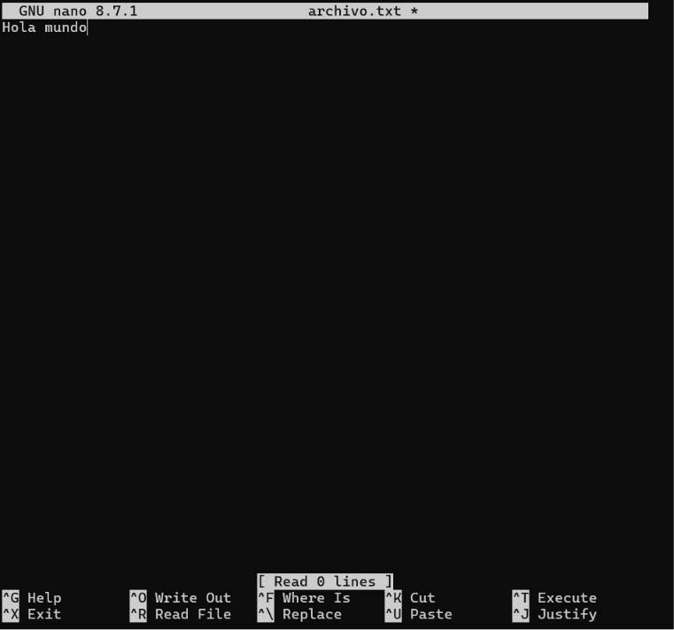

---

## Mostrar el contenido de un archivo

```bash
cat archivo.txt
```

Muestra el contenido del archivo en la terminal.


---

## Copiar un archivo

```bash
cp archivo.txt copia.txt
```

Copia el archivo con un nuevo nombre.

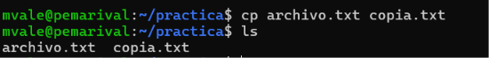
---

## Renombrar o mover un archivo

```bash
mv copia.txt respaldo.txt
```

Renombra el archivo o lo mueve a otra ubicación.


---

## Eliminar un archivo

```bash
rm respaldo.txt
```

Elimina el archivo indicado.


---

## Eliminar un directorio vacío

```bash
rmdir practica
```

Elimina el directorio si no contiene archivos.


---

## Actualizar la lista de paquetes

```bash
sudo apt update
```

Actualiza la lista de paquetes disponibles en los repositorios.

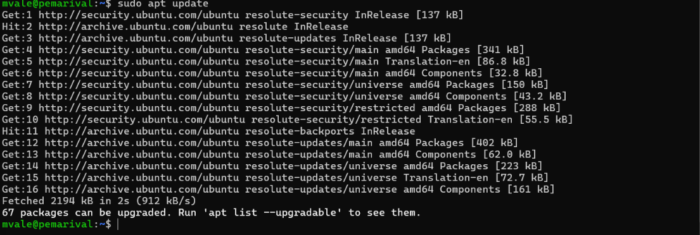

---

## Actualizar los paquetes instalados

```bash
sudo apt upgrade
```

Instala las versiones más recientes de los paquetes instalados.

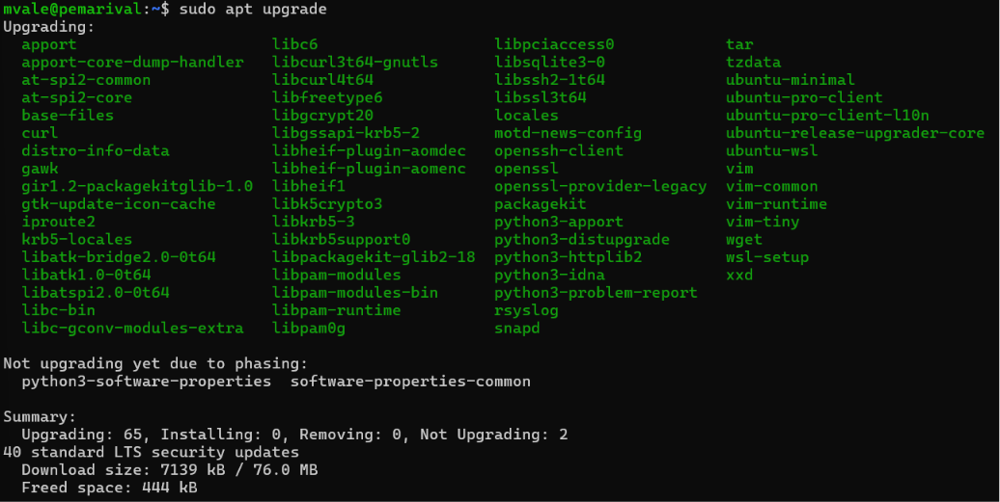

---

## Instalar Net Tools

```bash
sudo apt install net-tools
```

Instala herramientas clásicas de red como `netstat`.


---

## Instalar htop

```bash
sudo apt install htop
```

Instala el monitor de procesos `htop`.

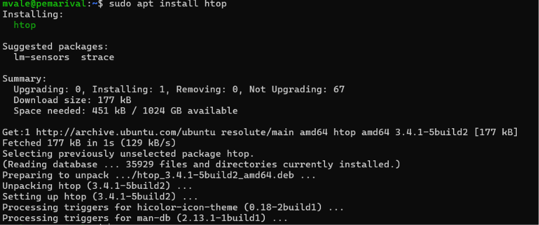

---

## Eliminar paquetes innecesarios

```bash
sudo apt autoremove
```

Elimina paquetes que ya no son utilizados por el sistema.

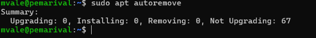
---

## Reiniciar WSL

```bash
sudo reboot
```

Reinicia la distribución de Ubuntu si **systemd** está habilitado; de lo contrario, puede no funcionar como en una instalación tradicional.


---

## Apagar WSL

```bash
sudo shutdown now
```

Apaga la distribución de Ubuntu si **systemd** está habilitado.


---

## Mostrar la versión del sistema

```bash
cat /proc/version
```

Muestra información sobre el kernel utilizado por WSL y el compilador empleado.

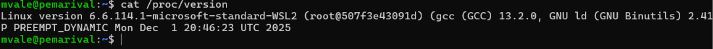

---

## Mostrar información del proceso inicial

```bash
cat /proc/1/cgroup
```

Muestra los grupos de control (cgroups) del proceso con PID 1.


---

## Detectar el entorno de virtualización

```bash
systemd-detect-virt
```

Indica que el sistema se está ejecutando sobre WSL u otro entorno virtualizado.


---

## Abrir el Explorador de Windows

```bash
explorer.exe .
```

Abre el directorio actual de WSL en el Explorador de archivos de Windows.

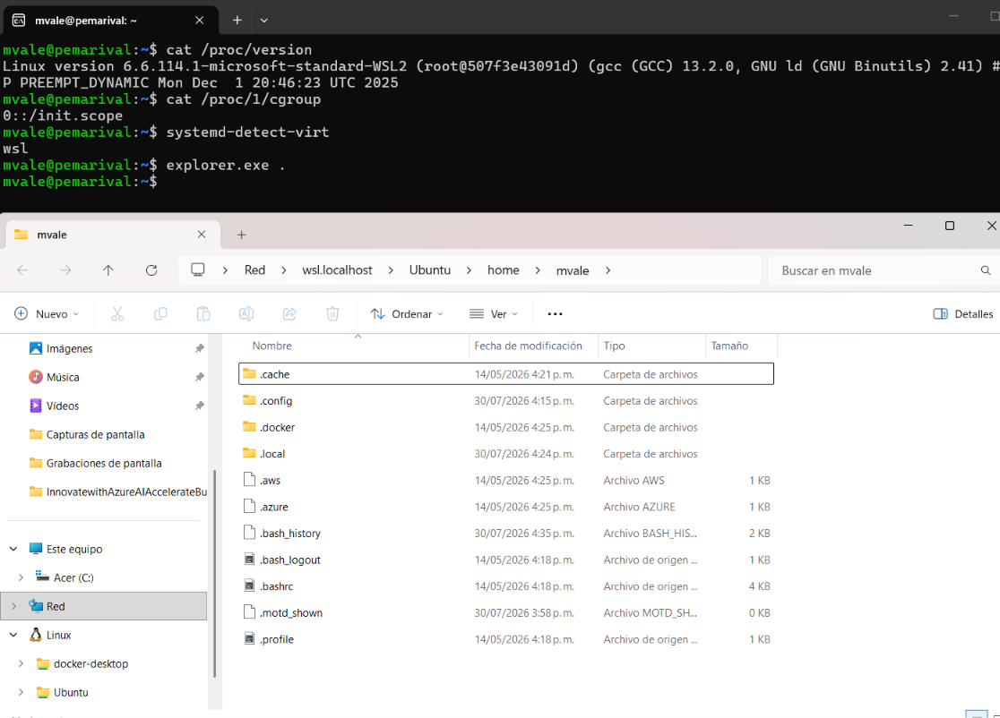

---

## Ejecutar un comando de Windows

```bash
cmd.exe /c dir
```

Ejecuta el comando `dir` de Windows desde la terminal de WSL.

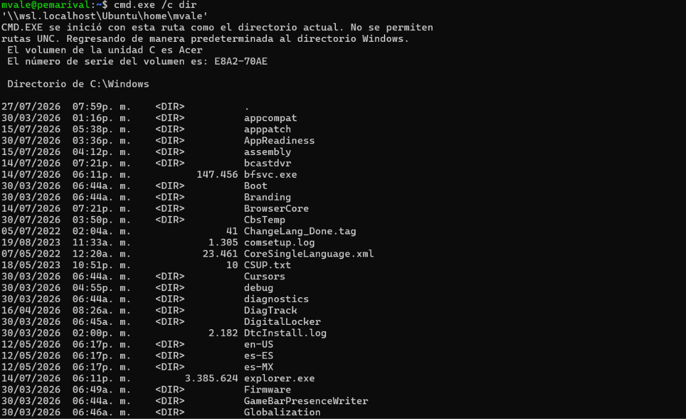
---

## Buscar información de virtualización

```bash
dmesg | grep -i virtual
```

Busca en los mensajes del kernel información relacionada con la virtualización.

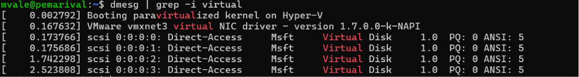