# Taller Práctico: Instalación de Ubuntu Server en Docker


## Integrantes

- Nombre 1 // Mariana Valenzuela Penagos
- Nombre 2 // Maria Jose Rodriguez Oyola


----------------
## PASO 1 — Crear el docker-compose.yml

¿Qué estamos haciendo?
- image: ubuntu:24.04 → Usamos la imagen oficial de Ubuntu.
- container_name: ubuntu-server → El contenedor tendrá ese nombre.
- stdin_open: true → Permite interactuar con la terminal.
- tty: true → Mantiene una terminal interactiva.
- command: /bin/bash → Al iniciar, entraremos a la terminal Bash de Ubuntu.

> docker compose pull

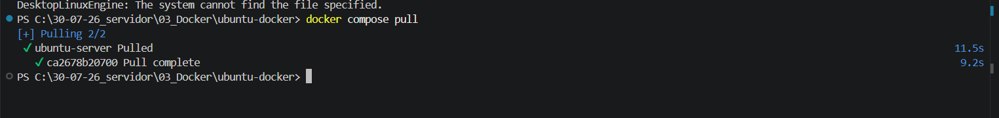

----------------------

## PASO 2 — Descargar la imagen de Ubuntu

> docker images

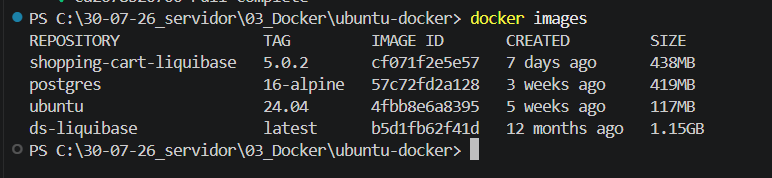

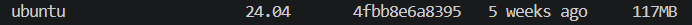

------------------

## PASO 3 — Crear y levantar el contenedor

>  docker compose up -d


> docker ps

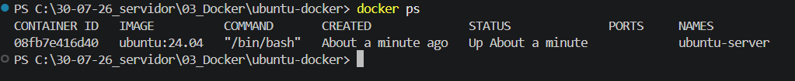

## PASO 4 — Entrar al Ubuntu del contenedor

Para eso ejecutamos :
> docker compose exec ubuntu-server bash

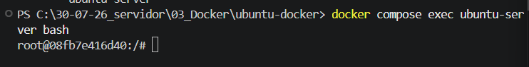

##  ¡Ya estás dentro de Ubuntu ejecutándose en Docker!  :) 

-----------------------
Ahora ejecutamos 

> cat /etc/os-release

- vemos la informacion de ubuntu 

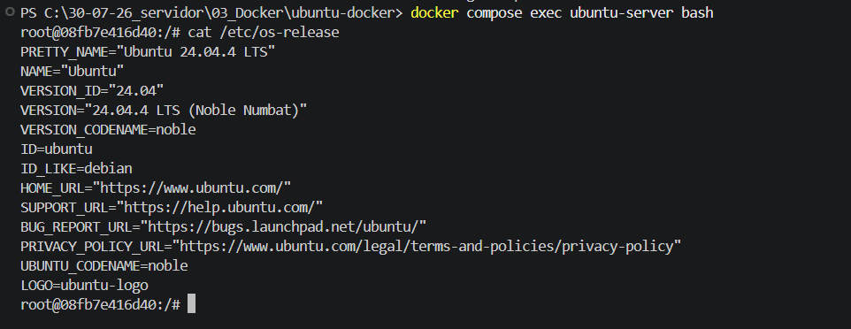


--------------
## PASO 5 — Actualizar Ubuntu

ejecutamos 

> apt update

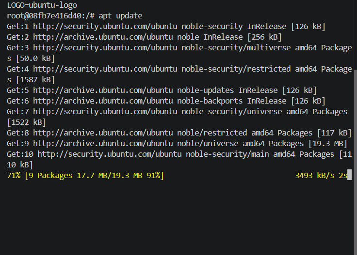

Cuando termine : se ejecuta 

>  apt upgrade -y

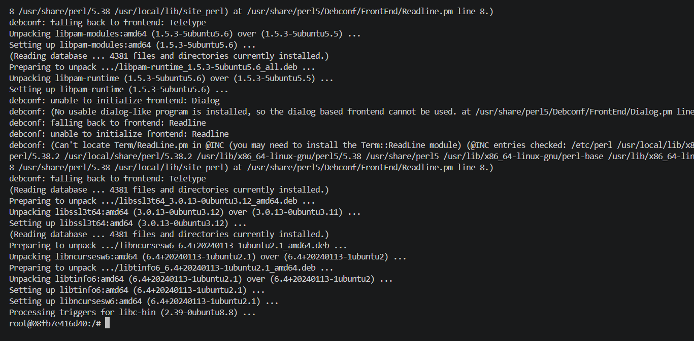

------------------------------------------

## PASO 6 — Instalar un paquete

ejecutamos 

> apt install -y curl

Para demostrar la instalación de paquetes, ejecuta:


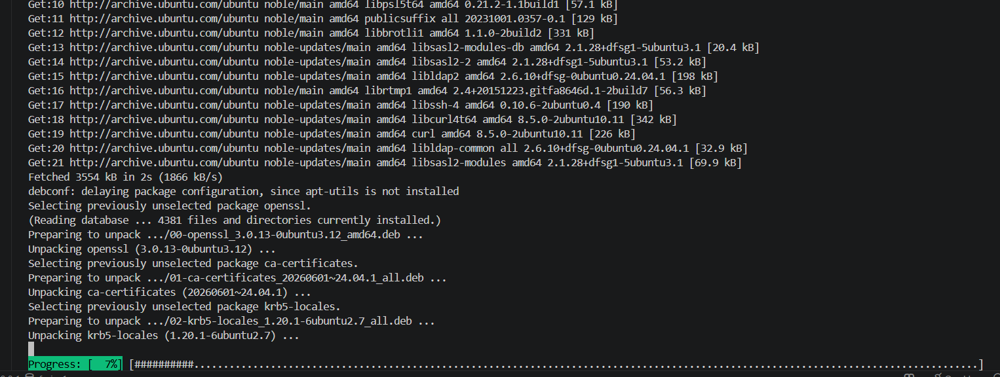

Después verifica:

> curl --version
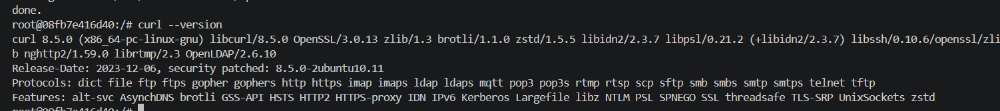

------------------------------------

## PASO 7 — Salir del contenedor

Cuando termines: 
> exit

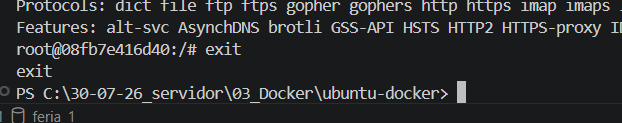

Puedes comprobar que el contenedor sigue funcionando:

> docker ps

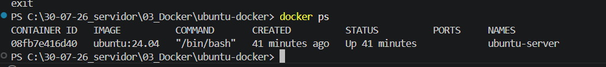

----------------------------------------


# Comandos del host Docker (Ubuntu)

## Mostrar la información del sistema operativo

```bash
cat /etc/os-release
```
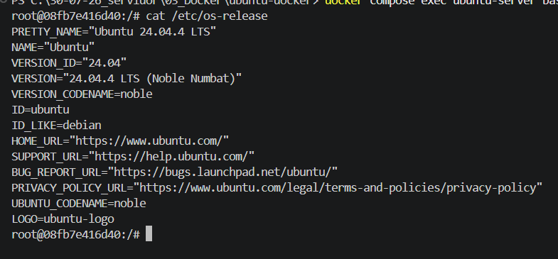

Muestra la distribución de Linux instalada, su versión y otros datos del sistema operativo.

---

## Mostrar información del kernel

```bash
uname -a
```
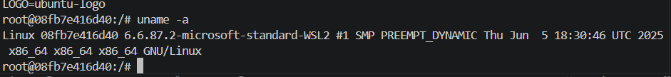

Muestra información completa del kernel, arquitectura, nombre del equipo y sistema operativo.

---

## Mostrar la versión del kernel

```bash
uname -r
```
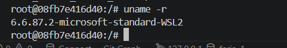

Muestra únicamente la versión del kernel de Linux.

---

## Mostrar la arquitectura del procesador

```bash
uname -m
```

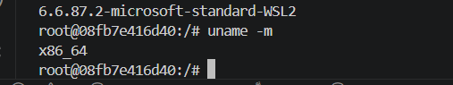

Indica la arquitectura del sistema, por ejemplo `x86_64`.

---

## Mostrar el nombre del equipo

```bash
hostname
```
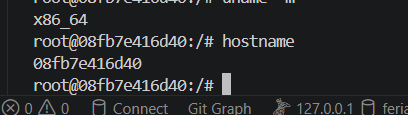


Muestra el nombre del host o computadora.

---

## Mostrar información del equipo

```bash
hostnamectl
```
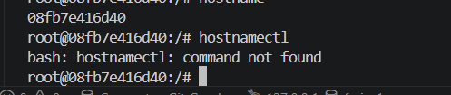

Presenta información del sistema como hostname, sistema operativo, kernel y arquitectura.

---

## Mostrar el usuario actual

```bash
whoami
```
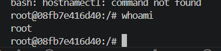

Indica el nombre del usuario que ha iniciado sesión.

---

## Mostrar el identificador del usuario

```bash
id
```
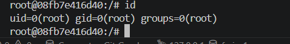

Muestra el UID, GID y los grupos a los que pertenece el usuario.

---

## Mostrar el directorio actual

```bash
pwd
```
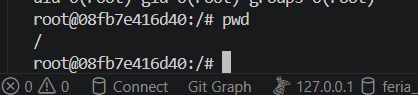

Indica la ruta completa del directorio en el que se encuentra el usuario.

---

## Listar archivos

```bash
ls
```
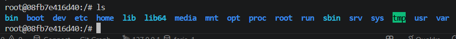

Muestra los archivos y carpetas del directorio actual.

---

## Listar archivos detalladamente

```bash
ls -la
```
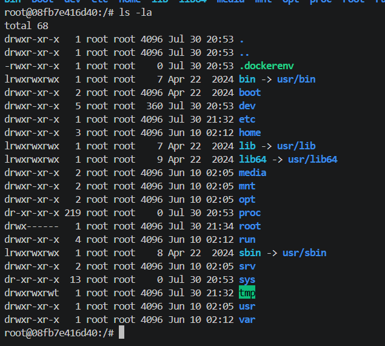

Muestra todos los archivos, incluidos los ocultos, junto con sus permisos, propietario y tamaño.

---

## Mostrar estructura de directorios

```bash
tree
```
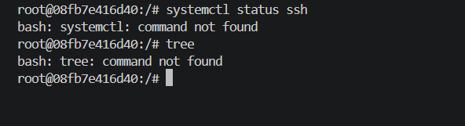

Muestra la estructura de carpetas en forma de árbol.

> Requiere instalar el paquete `tree`.

---

## Mostrar la fecha y hora

```bash
date
```
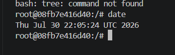

Muestra la fecha y hora actual del sistema.

---

## Mostrar el tiempo de actividad

```bash
uptime
```
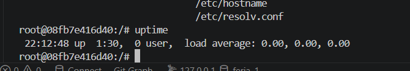

Indica cuánto tiempo lleva encendido el sistema y la carga del procesador.

---

## Mostrar el uso de memoria

```bash
free -h
```
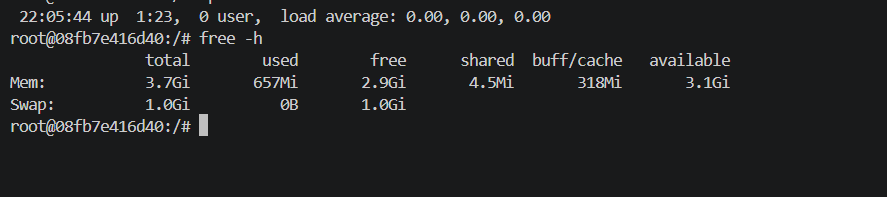

Muestra el uso de memoria RAM y swap en formato legible.

---

## Mostrar información del procesador

```bash
lscpu
```
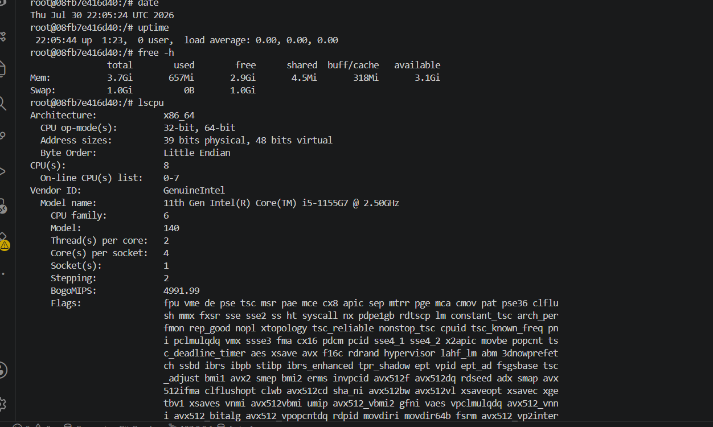

Presenta información detallada de la CPU.

---

## Mostrar dispositivos de almacenamiento

```bash
lsblk
```
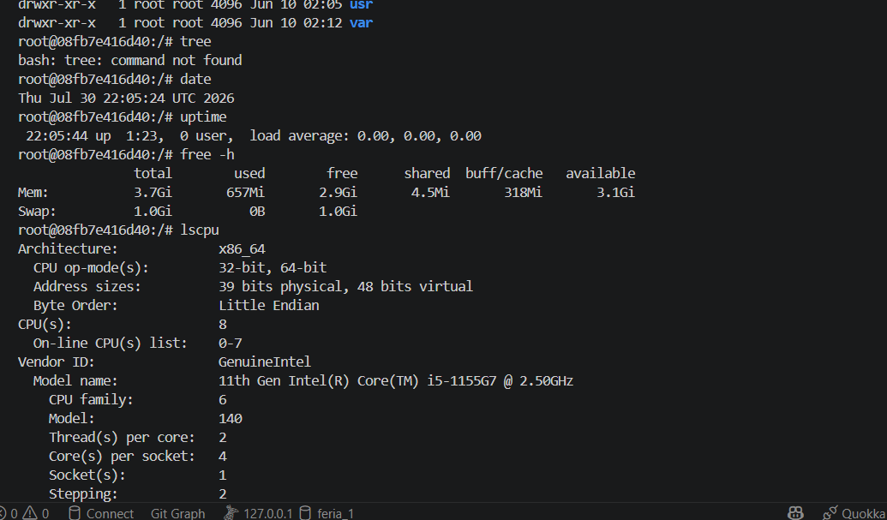

Lista los discos, particiones y dispositivos de almacenamiento.

---

## Mostrar el espacio en disco

```bash
df -h
```
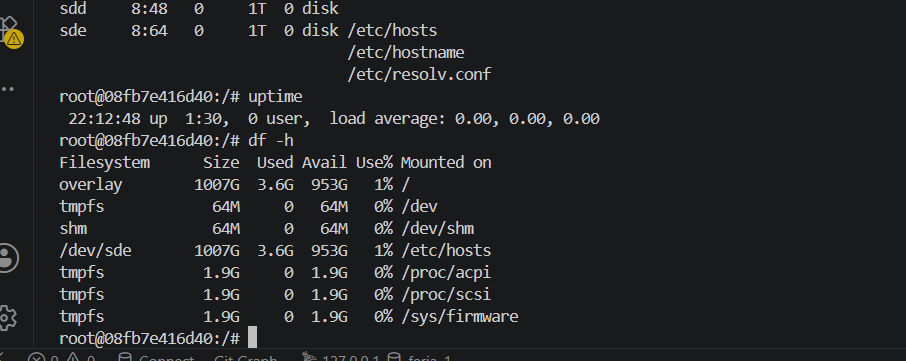

Muestra el espacio usado y disponible en los sistemas de archivos.

---

## Mostrar sistemas de archivos montados

```bash
mount
```
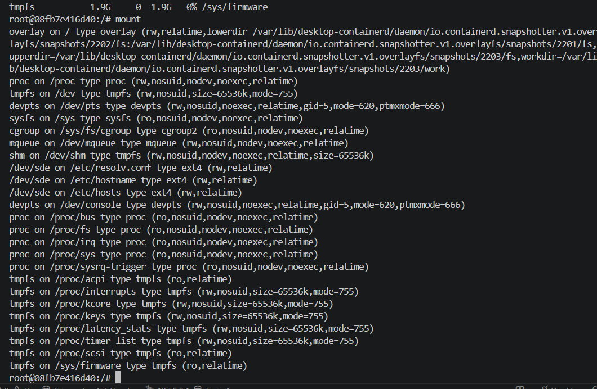

Lista todos los sistemas de archivos montados.

---

## Mostrar procesos en ejecución

```bash
ps aux
```
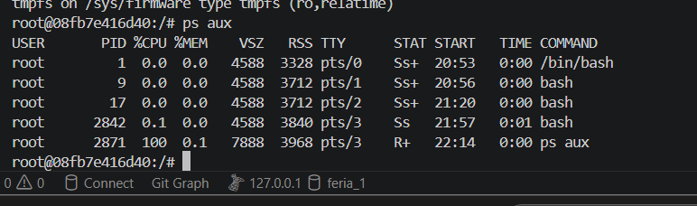

Muestra todos los procesos activos del sistema.

---

## Monitor de procesos

```bash
top
```
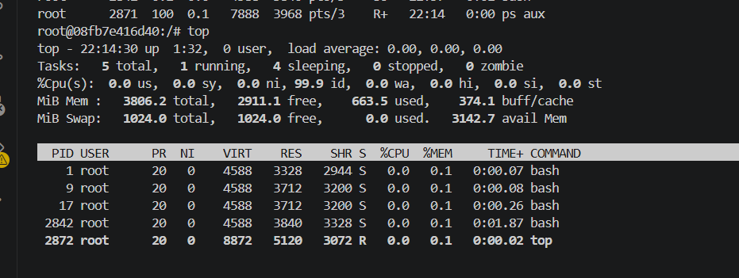

Muestra en tiempo real el consumo de CPU, memoria y procesos.

---

## Monitor de procesos mejorado

```bash
htop
```
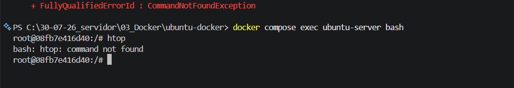

Versión interactiva de `top` con una interfaz más amigable.

> Requiere instalar el paquete `htop`.

---

## Consultar el estado del servicio SSH

```bash
systemctl status ssh
```
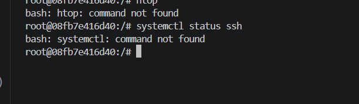

Muestra si el servicio SSH está activo y su estado.

> Requiere que el servicio SSH esté instalado y que el sistema utilice `systemd`.

---

## Listar los servicios

```bash
systemctl list-units --type=service
```
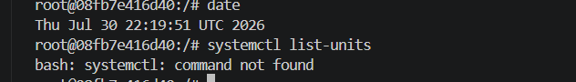

Lista todos los servicios administrados por `systemd`.

> Requiere que el sistema utilice `systemd`.

---

## Mostrar direcciones IP

```bash
ip addr
```
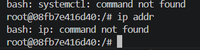
Muestra las interfaces de red y sus direcciones IP.

---

## Mostrar rutas de red

```bash
ip route
```
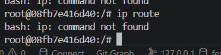

Muestra la tabla de enrutamiento del sistema.

---

## Mostrar la IP del equipo

```bash
hostname -I
```
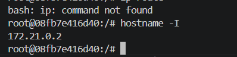

Muestra las direcciones IP asignadas al equipo.

---

## Probar la conexión a Internet

```bash
ping 8.8.8.8
```
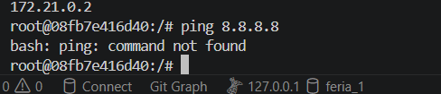

Comprueba la conectividad enviando paquetes al servidor DNS de Google.

---

## Probar la resolución DNS

```bash
ping google.com
```
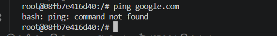

Comprueba tanto la conexión a Internet como la resolución de nombres DNS.

---

## Mostrar puertos abiertos

```bash
ss -tulnp
```
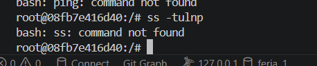

Lista los puertos TCP y UDP abiertos junto con los procesos asociados.

---

## Mostrar conexiones de red

```bash
netstat -tulnp
```
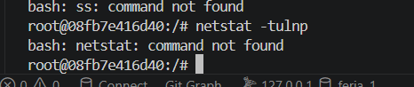

Muestra los puertos abiertos y conexiones activas.

> Requiere instalar el paquete `net-tools`.

---

## Mostrar la IP pública

```bash
curl ifconfig.me
```
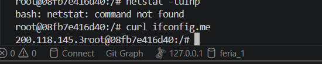

Obtiene la dirección IP pública del equipo desde Internet.

---

## Mostrar variables de entorno

```bash
env
```
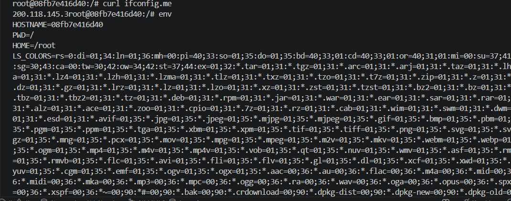

Muestra todas las variables de entorno disponibles.

---

## Mostrar historial de comandos

```bash
history
```
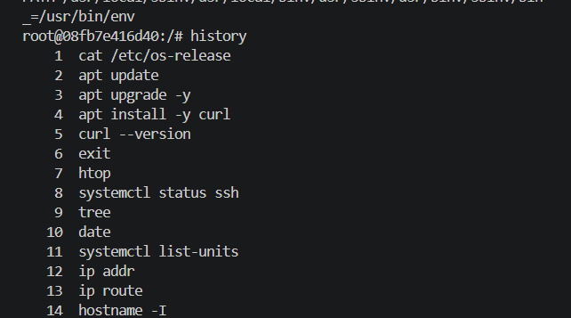

Muestra el historial de comandos ejecutados por el usuario.

---

## Crear un directorio

```bash
mkdir practica
```

Crea una carpeta llamada `practica`.

---

## Cambiar de directorio

```bash
cd practica
```
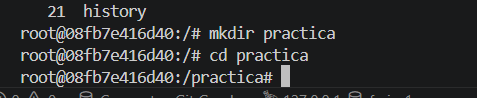

Ingresa al directorio llamado `practica`.

---

## Crear un archivo vacío

```bash
touch archivo.txt
```
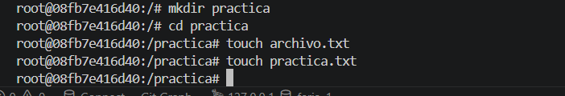

Crea un archivo vacío llamado `archivo.txt`.

---

## Editar un archivo

```bash
nano archivo.txt
```

Abre el archivo en el editor de texto Nano.

---

## Mostrar el contenido de un archivo

```bash
cat archivo.txt
```

Muestra el contenido del archivo en la terminal.

---

## Copiar un archivo

```bash
cp archivo.txt copia.txt
```

Copia el archivo con un nuevo nombre.

---

## Renombrar o mover un archivo

```bash
mv copia.txt respaldo.txt
```

Renombra el archivo o lo mueve a otra ubicación.

---

## Eliminar un archivo

```bash
rm respaldo.txt
```

Elimina el archivo indicado.

---

## Eliminar un directorio vacío

```bash
rmdir practica
```

Elimina el directorio si no contiene archivos.

---

## Actualizar la lista de paquetes

```bash
sudo apt update
```
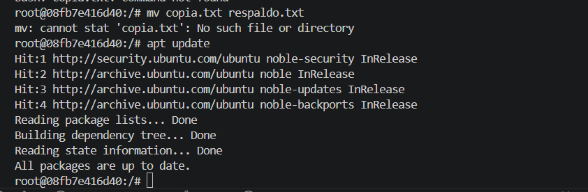

Actualiza la lista de paquetes disponibles en los repositorios.

---

## Actualizar los paquetes instalados

```bash
sudo apt upgrade
```
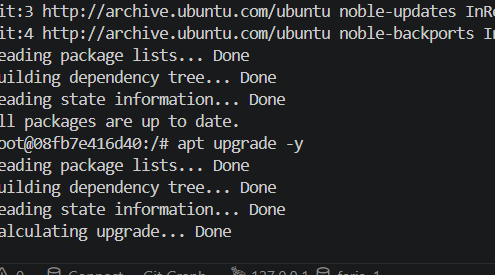

Instala las versiones más recientes de los paquetes instalados.

---

## Instalar Net Tools

```bash
sudo apt install net-tools
```


Instala herramientas clásicas de red como `netstat`.

---

## Instalar htop

```bash
sudo apt install htop
```


Instala el monitor de procesos `htop`.

---

## Eliminar paquetes innecesarios

```bash
sudo apt autoremove
```


Elimina paquetes que ya no son utilizados por el sistema.

---

## Reiniciar el sistema

```bash
sudo reboot
```

Reinicia el sistema operativo.

---

## Apagar el sistema

```bash
sudo shutdown now
```

Apaga inmediatamente el sistema.

---

## Mostrar la versión del sistema

```bash
cat /proc/version
```

Muestra información sobre el kernel y el compilador utilizado.

---

## Mostrar información del proceso inicial

```bash
cat /proc/1/cgroup
```

Muestra los grupos de control (cgroups) del proceso con PID 1.

---

## Detectar el entorno de virtualización

```bash
systemd-detect-virt
```

Indica si el sistema se ejecuta en una máquina virtual o sobre otra tecnología de virtualización.

---

## Mostrar el modelo del sistema

```bash
sudo dmidecode -s system-product-name
```

Muestra el nombre o modelo del equipo o máquina virtual.

---

## Mostrar el hardware del sistema

```bash
sudo lshw -short
```

Presenta un resumen del hardware instalado.

---

## Listar contenedores en ejecución

```bash
docker ps
```

Muestra los contenedores Docker que se encuentran en ejecución.

---

## Listar todos los contenedores

```bash
docker ps -a
```

Muestra todos los contenedores, incluidos los detenidos.

---

## Listar imágenes Docker

```bash
docker images
```

Muestra las imágenes almacenadas en el host Docker.

---

## Listar volúmenes Docker

```bash
docker volume ls
```

Muestra los volúmenes creados en Docker.

---

## Listar redes Docker

```bash
docker network ls
```

Muestra las redes disponibles en Docker.

---

## Acceder a un contenedor

```bash
docker exec -it <contenedor> bash
```

Abre una terminal interactiva dentro del contenedor especificado.

---

## Inspeccionar un contenedor

```bash
docker inspect <contenedor>
```

Muestra información detallada del contenedor en formato JSON.

---

## Ver los registros de un contenedor

```bash
docker logs <contenedor>
```

Muestra los registros generados por el contenedor.

---

## Ver el consumo de recursos

```bash
docker stats
```

Muestra el uso de CPU, memoria y red de los contenedores en tiempo real.

---

## Mostrar información de Docker

```bash
docker info
```

Presenta información general sobre Docker, como almacenamiento, redes y número de contenedores e imágenes.

---

## Buscar información de virtualización

```bash
dmesg | grep -i virtual
```
