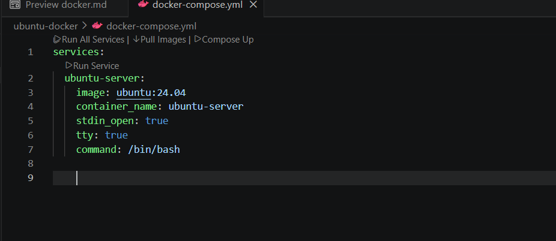
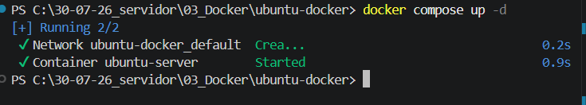
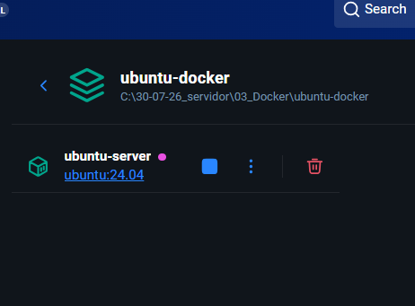
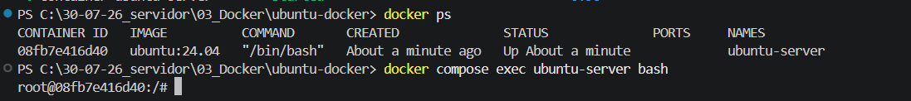

# Taller Práctico: Instalación de Ubuntu Server en Docker

## Integrantes

- Nombre 1 // Mariana Valenzuela Penagos
- Nombre 2 // Maria Jose Rodriguez Oyola

# Paso 1 : Creamos el docker compose
Crear el compose para tener
- image: ubuntu:24.04 → Usamos la imagen oficial de Ubuntu.
- container_name: ubuntu-server → El contenedor tendrá ese - nombre.
- stdin_open: true → Permite interactuar con la terminal.
- tty: true → Mantiene una terminal interactiva.
- command: /bin/bash → Al iniciar, entraremos a la terminal  Bash de Ubuntu.

--------------------
# Paso 2 : Descargar la imagen de Ubuntu

Docker descargará:
> ubuntu:24.04

para eso  se debe ejecutar 
> docker compose pull

-----------------------------------------
## Después verifica que la imagen está descargada:

Para eso  se debe ejecutar 
> docker images

-----------------------------------

# Crear y levantar el contenedor

para eso se ejecuta 
> docker compose up -d

Esto crea el contenedor y lo deja ejecutando 

Para eso se ejecuta 
> docker ps

-----------------

# Paso 3 : Entrar al Ubuntu del contenedor

Para eso ejecutamos

> docker compose exec ubuntu-server bash

